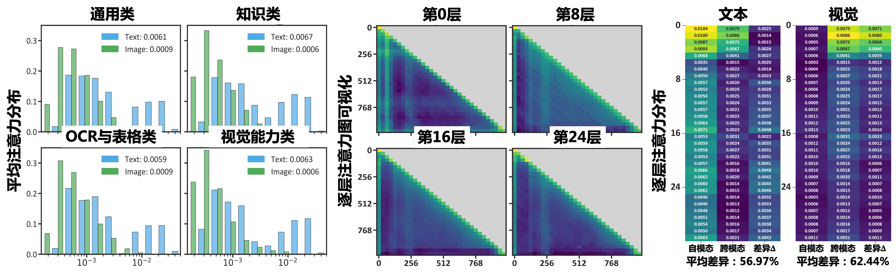

# 精选情感计算方法

🔥🔥🔥 **ICML 2025 Spotlight | MART: Masked Affective RepresenTation Learning via Masked Temporal Distribution Distillation**  

    

[[📖 论文](https://arxiv.org/abs/2507.04635)]
[[🌟 代码](https://github.com/KwaiVGI/MODA)]
[[🛜 模型](https://huggingface.co/KwaiVGI/MODA)]
[[🖼️ 海报](https://zzcheng.top/assets/pdf/2025_ICML_MODA_poster.pdf)]
[[🖼️ 宣讲](https://zzcheng.top/assets/pdf/2025_ICML_MODA_slide.pdf)]
[[👍 主页](https://zzcheng.top/MODA/)]

  

 以语言为中心的预训练机制导致现有多模态大模型存在模态偏置，难以关注到细粒度的情感线索。快手可灵团队与南开大学在「多模态情感理解」领域完成了开创性研究，成功定位了现有多模态大模型在情感线索捕捉中的关键短板。研究团队从多模态注意力机制的维度切入，提出了新的模块化双工注意力范式，并基于此构建了一个涵盖感知、认知与情感能力的多模态模型‘摩达（MODA）’。该模型在通用对话、知识问答、表格处理、视觉感知、认知分析和情感理解等六大类任务的21个基准测试中均实现了显著性能提升。此外，基于新的注意力机制，‘摩达’在角色剖析与规划演绎等人机交互场景中表现出色。目前，该研究成果已被ICML 2025收录，并获选焦点论文（Spotlight，Top 2.6%）。 ✨ 

---

🔥🔥🔥 **CVPR 2024 | MART: Masked Affective RepresenTation Learning via Masked Temporal Distribution Distillation**  

    

[[📖 论文](https://openaccess.thecvf.com/content/CVPR2024/papers/Zhang_MART_Masked_Affective_RepresenTation_Learning_via_Masked_Temporal_Distribution_Distillation_CVPR_2024_paper.pdf)]
[[🌟 代码](https://github.com/nku-zhichengzhang/MART)]
[[🖼️ 海报](https://zzcheng.top/assets/pdf/2024_CVPR_MART_poster.pdf)]
[[👍 主页](https://zzcheng.top/MART/)]
[[👍 Demo](https://zzcheng.top/projects/VER/)]

  

 当标签极度稀缺时，急需挖掘一种低开销、无需标注的大规模监督信号。为此，提出一种掩码情感建模方法，利用视频的语言学情感线索，恢复情感的时域分布来学习辨别表征。 ✨ 

---

🔥🔥🔥 **CVPR 2023 | Weakly Supervised Video Emotion Detection and Prediction via Cross-Modal Temporal Erasing Network**  

    

[[📖 论文](https://openaccess.thecvf.com/content/CVPR2023/papers/Zhang_Weakly_Supervised_Video_Emotion_Detection_and_Prediction_via_Cross-Modal_Temporal_CVPR_2023_paper.pdf)]
[[🌟 代码](https://github.com/nku-zhichengzhang/CTEN)]
[[📺 讲解视频](https://www.youtube.com/watch?v=ebD_xNQLuCY)]

  

 一种用于视频情感分析的跨模态时间擦除网络，能够以弱监督方式定位关键帧、上下文以及与音频相关的信息 ✨ 

---

🔥🔥🔥 **ACM MM 2022 | Temporal Sentiment Localization: Listen and Look in Untrimmed Videos**  

    

[[📖 论文](https://zzcheng.top/assets/pdf/2022_ACMMM_TSL300.pdf)]
[[🌟 代码](https://github.com/nku-zhichengzhang/TSL300)]
[[📺 讲解视频](https://www.youtube.com/watch?v=znZZMq6YdBg)]

  

 为解决密集标注数据集的高成本问题，提出了TSL-Net，一种利用单帧监督来定位视频中的情感的弱监督框架 ✨ 

---

🔥🔥🔥 **AAAI 2020 | An End-to-End Visual-Audio Attention Network for Emotion Recognition in User-Generated Videos**  

[[📖 论文](https://arxiv.org/abs/2003.00832)]
[[🌟 代码](https://github.com/maysonma/VAANet)]

  

---

🔥🔥🔥 **TAC 2024 | Looking into Gait for Perceiving Emotions via Bilateral Posture and Movement Graph Convolutional Networks**  

[[📖 论文](https://ieeexplore.ieee.org/document/10433680)]

  