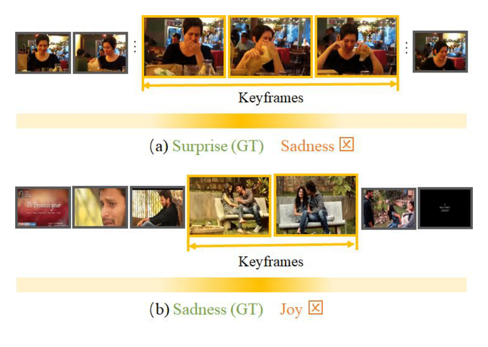

# 精选情感计算方法

🔥🔥🔥 **CVPR23 | Weakly Supervised Video Emotion Detection and Prediction via Cross-Modal Temporal Erasing Network**  

    

[[📖 论文](https://openaccess.thecvf.com/content/CVPR2023/papers/Zhang_Weakly_Supervised_Video_Emotion_Detection_and_Prediction_via_Cross-Modal_Temporal_CVPR_2023_paper.pdf)]
[[🌟 代码](https://github.com/nku-zhichengzhang/CTEN)]
[[📺 讲解视频](https://www.youtube.com/watch?v=ebD_xNQLuCY)]

  

 一种用于视频情感分析的跨模态时间擦除网络，能够以弱监督方式定位关键帧、上下文以及与音频相关的信息 ✨ 

---

🔥🔥🔥 **ACM MM22 | Temporal Sentiment Localization: Listen and Look in Untrimmed Videos**  

    

[[📖 论文](https://github.com/nku-zhichengzhang/TSL300/blob/main/assests/acm22_zzc_videosenti_official.pdf)]
[[🌟 代码](https://github.com/nku-zhichengzhang/TSL300)]
[[📺 讲解视频](https://www.youtube.com/watch?v=znZZMq6YdBg)]

  

 为解决密集标注数据集的高成本问题，提出了TSL-Net，一种利用单帧监督来定位视频中的情感的弱监督框架 ✨ 

---

🔥🔥🔥 **AAAI20 | An End-to-End Visual-Audio Attention Network for Emotion Recognition in User-Generated Videos**  

[[📖 论文](https://arxiv.org/abs/2003.00832)]
[[🌟 代码](https://github.com/maysonma/VAANet)]

  

---

🔥🔥🔥 **TAC | Looking into Gait for Perceiving Emotions via Bilateral Posture and Movement Graph Convolutional Networks**  

[[📖 论文](https://ieeexplore.ieee.org/document/10433680)]

  