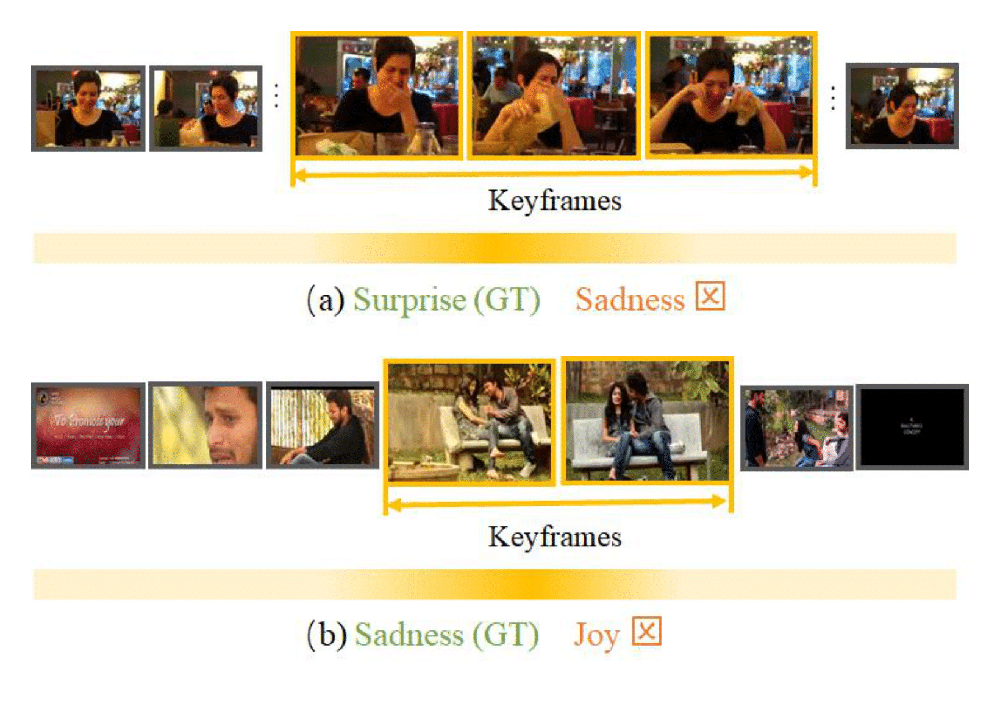

# Awesome-Affective-Computing-Methods

🔥🔥🔥 **ICML 2025 Spotlight | MART: Masked Affective RepresenTation Learning via Masked Temporal Distribution Distillation**  

    

[[📖 Paper](https://arxiv.org/abs/2507.04635)]
[[🌟 Github](https://github.com/KwaiVGI/MODA)]
[[🛜 模型](https://huggingface.co/KwaiVGI/MODA)]
[[🖼️ Poster](https://zzcheng.top/assets/pdf/2025_ICML_MODA_poster.pdf)]
[[🖼️ 宣讲](https://zzcheng.top/assets/pdf/2025_ICML_MODA_slide.pdf)]
[[👍 Project](https://zzcheng.top/MODA/)]

  

 The language-centric pretraining mechanism in existing large-scale multimodal models often results in modality bias, making it challenging to capture fine-grained emotional cues. To address this, the Kuaishou Keling team, in collaboration with Nankai University, conducted pioneering research in the field of "multimodal emotion understanding," successfully identifying critical limitations of current multimodal models in detecting emotional signals. The research team introduced a novel modular duplex attention paradigm by focusing on the dimensions of multimodal attention mechanisms. Building on this framework, they developed a multimodal model named MODA, which integrates capabilities in perception, cognition, and emotion understanding. MODA demonstrated substantial performance improvements across 21 benchmark tests spanning six major task categories: general QA, knowledge QA, table & ocr, visual-centric, cognitive analysis, and emotion understanding. Additionally, thanks to the innovative attention mechanism, MODA excelled in human-computer interaction scenarios such as character profiling and planning deduction. This groundbreaking work has been accepted by ICML 2025 and selected as a **Spotlight Paper (Top 2.6%)**. ✨ 

---

🔥🔥🔥 **CVPR 2024 | MART: Masked Affective RepresenTation Learning via Masked Temporal Distribution Distillation**  

    

[[📖 Paper](https://openaccess.thecvf.com/content/CVPR2024/papers/Zhang_MART_Masked_Affective_RepresenTation_Learning_via_Masked_Temporal_Distribution_Distillation_CVPR_2024_paper.pdf)]
[[🌟 Github](https://github.com/nku-zhichengzhang/MART)]
[[🖼️ Poster](https://zzcheng.top/assets/pdf/2024_CVPR_MART_poster.pdf)]
[[👍 Project](https://zzcheng.top/MART/)]
[[👍 Demo](https://zzcheng.top/projects/VER/)]

  

 When labels are extremely scarce, there is an urgent need to explore a low-cost, annotation-free large-scale supervision signal. To address this, a masked emotion modeling method is proposed, which leverages linguistic emotional cues from videos to reconstruct the temporal distribution of emotions for learning discriminative representations. ✨ 

---

🔥🔥🔥 **CVPR 2023 | Weakly Supervised Video Emotion Detection and Prediction via Cross-Modal Temporal Erasing Network**  

    

[[📖 Paper](https://openaccess.thecvf.com/content/CVPR2023/papers/Zhang_Weakly_Supervised_Video_Emotion_Detection_and_Prediction_via_Cross-Modal_Temporal_CVPR_2023_paper.pdf)]
[[🌟 GitHub](https://github.com/nku-zhichengzhang/CTEN)]
[[📺 Video](https://www.youtube.com/watch?v=ebD_xNQLuCY)]

  

 A cross-modal temporal erasing network for video emotion analysis that locates not only keyframes but also context and audio-related information in a weakly-supervised manner ✨ 

---

🔥🔥🔥 **ACM MM 2022 | Temporal Sentiment Localization: Listen and Look in Untrimmed Videos**  

    

[[📖 Paper](https://zzcheng.top/assets/pdf/2022_ACMMM_TSL300.pdf)]
[[🌟 GitHub](https://github.com/nku-zhichengzhang/TSL300)]
[[📺 Video](https://www.youtube.com/watch?v=znZZMq6YdBg)]

  

 Due to the high cost of labeling a densely annotated dataset, we propose TSL-Net in this work, employing single-frame supervision to localize sentiment in videos ✨ 

---

🔥🔥🔥 **AAAI 2020 | An End-to-End Visual-Audio Attention Network for Emotion Recognition in User-Generated Videos**  

[[📖 Paper](https://arxiv.org/abs/2003.00832)]
[[🌟 GitHub](https://github.com/maysonma/VAANet)]

  

---

🔥🔥🔥 **TAC 2024 | Looking into Gait for Perceiving Emotions via Bilateral Posture and Movement Graph Convolutional Networks**  

[[📖 Paper](https://ieeexplore.ieee.org/document/10433680)]

  