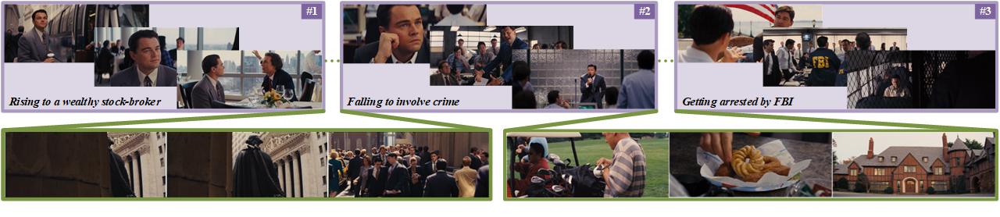

<div align="center">

# **Temporal Sentiment Localization**: Listen and Look in Untrimmed Videos


<i>Zhicheng Zhang and Jufeng Yang</i>


[](https://2022.acmmm.org/)
[](./LICENSE)

</div>



**Key motivation:** *a video may convey multiple sentiments and each sentiment appears with varying lengths and locations.* Images come from ***"The Wolf of Wall Street"***.

This repository contains the official implementation with **Jittor** of our work in ACM MM 2022. TSL-300 dataset and jittor training/validation code for **weakly-supervised framework TSL-Net** are released. More details can be viewed in our paper. [[PDF]](./assests/acm22_zzc_videosenti_official.pdf) [[Video]](https://www.youtube.com/watch?v=znZZMq6YdBg)


## Abstract

Video sentiment analysis aims to uncover the underlying attitudes of viewers, which has a wide range of applications in real world. Existing works simply classify a video into a single sentimental category, ignoring the fact that sentiment in untrimmed videos may appear in multiple segments with varying lengths and unknown locations. To address this, we propose a challenging task, *i.e.*, **T**emporal **S**entiment **L**ocalization (**TSL**), to find which parts of the video convey sentiment. To systematically investigate fully- and weakly-supervised settings for TSL, we first build a benchmark dataset named TSL-300, which is consisting of 300 videos with a total length of 1,291 minutes. Each video is labeled in two ways, one of which is frame-by-frame annotation for the fully-supervised setting, and the other is single-frame annotation, *i.e.*, only a single frame with strong sentiment is labeled per segment for the weakly-supervised setting. Due to the high cost of labeling a densely annotated dataset, we propose TSL-Net in this work, employing single-frame supervision to localize sentiment in videos. In detail, we generate the pseudo labels for unlabeled frames using a greedy search strategy, and fuse the affective features of both visual and audio modalities to predict the temporal sentiment distribution. Here, a reverse mapping strategy is designed for feature fusion, and a contrastive loss is utilized to maintain the consistency between the original feature and the reverse prediction. Extensive experiments  show the superiority of our method against the state-of-the-art approaches.
## Framework
This project is built on the Jittor deep learning framework.

Jittor: A deep learning framework based entirely on Just-in-time compilation, using innovative meta-operators and unified computing graphs internally.

You can set up the environments by using `pip3 install -r requirements.txt`.

## Dependencies

#### Recommended Environment

* Python 3.8.0
* jittor 1.3.9.14
* CUDA 11.3

## Requirements
* joblib==0.14.0
* librosa==0.9.1
* matplotlib==3.3.4
* natsort==8.1.0
* numpy==1.22.0
* opencv_python_headless==4.5.5.62
* pandas==1.1.4
* scipy==1.4.1
* seaborn==0.11.2
* tensorboard_logger==0.1.0
* tensorboardX==2.5
* tqdm==4.62.3
* jittor==1.3.9.14

## TSL-300 dataset

If you need the TSL-300 dataset for academic purposes, please download the [application form](./assests/TSL-300_Data_Access_Form.docx) and fill out the request information, then send it to ***gloryzzc6@sina.com***.
We will process your application as soon as possible.
Please make sure that the email used comes from your educational institution.

## Data Preparation
1. Prepare [TSL-300](./assests/TSL-300_Data_Access_Form.docx) dataset.
    - We have provided constructed dataset and pre-extracted features.

2. Extract features with two-stream I3D networks
    - We recommend extracting features using [this repo](https://github.com/piergiaj/pytorch-i3d).
    - For convenience, we provide the features we used, which is also included in our dataset.
    - Link the features folder by using `sudo ln -s path-to-feature ./dataset/VideoSenti/`.
    
3. Place the features inside the `dataset` folder.
    - Please ensure the data structure is as below.

~~~~
├── dataset
   └── VideoSenti
       ├── gt.json
       ├── split_train.txt
       ├── split_test.txt
       ├── fps_dict.json
       ├── time.json
       ├── videosenti_gt.json
       ├── point_gaussian
           └── point_labels.csv
           ├── train
       └── features
           ├── train
               ├── rgb
                   ├── 1_Ekman6_disgust_3.npy
                   ├── 2_Ekman6_joy_1308.npy
                   └── ...
               └── logmfcc
                   ├── 1_Ekman6_disgust_3.npy
                   ├── 2_Ekman6_joy_1308.npy
                   └── ...
           └── test
               ├── rgb
                   ├── 9_CMU_MOSEI_lzVA--tIse0.npy
                   ├── 17_CMU_MOSEI_CbRexsp1HKw.npy
                   └── ...
               └── logmfcc
                   ├── 9_CMU_MOSEI_lzVA--tIse0.npy
                   ├── 17_CMU_MOSEI_CbRexsp1HKw.npy
                   └── ...
~~~~

## Performance

| Metric                  | PyTorch  | Jittor  |
|-------------------------|----------|---------|
| Average Forward Time (train)    | 0.324s   | 0.068s  |
| Average Memory Usage (train)    | 11319MB  | 16132MB |
| Single Iteration Time(train)   | 1.162s   | 0.981s  |
| Average_mAP[0.1:0.3] (test)    | 0.1985   | 0.1949  |
| Average_pAP[0.1:0.3] (test)    | 0.2106   | 0.2095  |
| Average_nAP[0.1:0.3] (test)   | 0.1865   | 0.1803  |
| F2@AVG (test)                  | 0.3369   | 0.3577  |

## Evaulation

The pre-trained model can be found in [pretrained model](https://drive.google.com/file/d/1H2QXAMQfPvH1N2PZ98s9rrb2Dd-hHWN9/view?usp=sharing).

You can evaluate the model by running the command below.

~~~~
$ bash run_eval.sh
~~~~

## Running
You can easily train and evaluate the model by running the script below.


You can include more details such as epoch, batch size, etc. Please refer to `options.py`.

~~~~
$ bash run_train.sh
~~~~


## References
We referenced the repos below for the code.

* [STPN](https://github.com/bellos1203/STPN)
* [SF-Net](https://github.com/Flowerfan/SF-Net)
* [ActivityNet](https://github.com/activitynet/ActivityNet)
* [LACP](https://github.com/Pilhyeon/Learning-Action-Completeness-from-Points)
* [TSL300-torch](https://github.com/nku-zhichengzhang/TSL300)

## Citation

If you find this repo useful in your project or research, please consider citing the relevant publication.

````
@inproceedings{zhang2022temporal,
  title={Temporal Sentiment Localization: Listen and Look in Untrimmed Videos},
  author={Zhang, Zhicheng and Yang, Jufeng},
  booktitle={Proceedings of the 30th ACM International Conference on Multimedia},
  year={2022}
}
````
